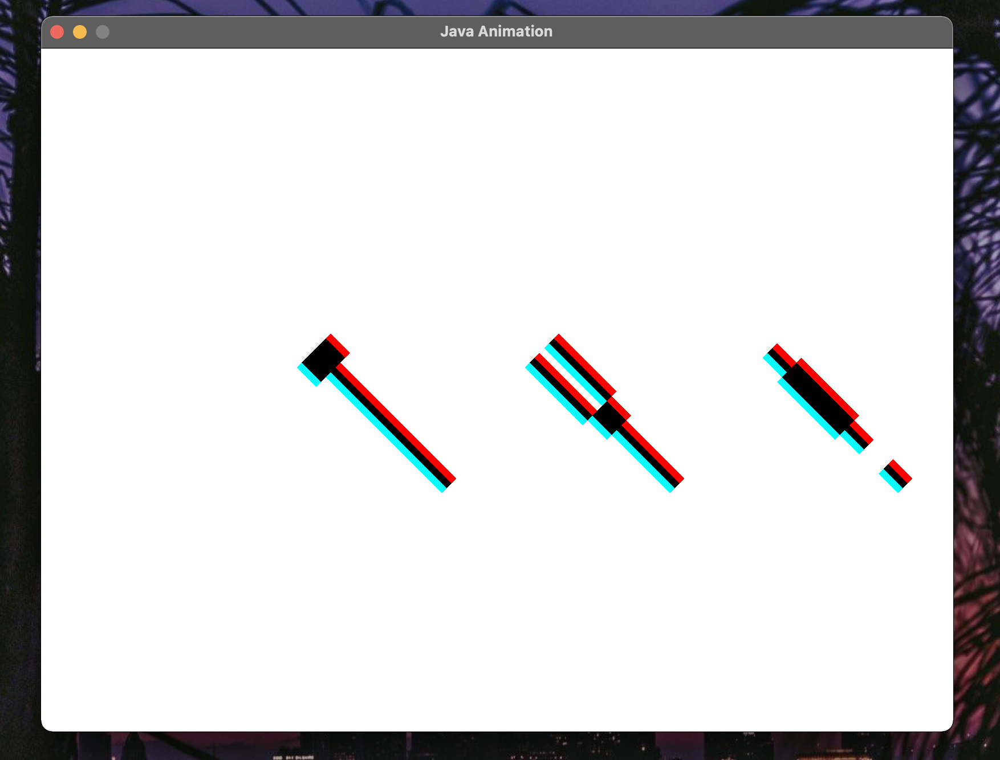

# CMSC 405 - Project 1 - Java 2D Graphics

**Author:** Tyler D Clark  
**Date:** 23 January 2021

**Description** A program that create 3 simple images from 2 dimensional arrays and then draws them. The program then translates, rotates and scales them using Java 2D.

___

## File Layout

``` bash
|____out
| |____project1.jar
|____doc
| |____img
| |____project1.md
|____src
| |____META-INF
| | |____MANIFEST.MF
| |____main
| | |____java
| | | |____PixelImage.java
| | | |____App.java
| | | |____Project1.java
```

## UML Diagram


## Running this program

This program was compiled into a jar file for ease of use. The only requirement for this program is an up-to-date Java runtime to be installed on the machine. To run this program, simply enter the command while in the out directory:

``` bash
java -jar project1.jar
```

Screenshot:


## Testing the Program

The following sections will test the program's various functionalities. Each test correlates to the frame number of the program's animation.

|Test Case|Java 2D Graphics Transformation Method|Expected Output|Actual Output|Pass/Fail
|---|---|---|---|---|
|1|None - images unaffected| Original images|Original images|Pass|
|2|translate()| Translate -5 in x direction, Translate +7 in the y direction|Translate -5 in x direction, Translate +7 in the y direction|Pass|
|3|rotate()|Rotate 45° counter clockwise|Rotate 45° counter clockwise|Pass|
|4|rotate()|Rotate 90° clockwise|Rotate 90° clockwise|Pass|
|5|scale()|Scale 2 times for the x component, scale 0.5 times for the y component|Scale 2 times for the x component, scale 0.5 times for the y component|Pass|

## Screenshots

### Test case 1

The original images without transformations

### Test case 2

The images translated (-5, 7)

### Test case 3

The images rotated 45° counter clockwise

### Test case 4

The images rotated 90° clockwise

### Test case 5

The images scaled 2 times for the x component, scale 0.5 times for the y component