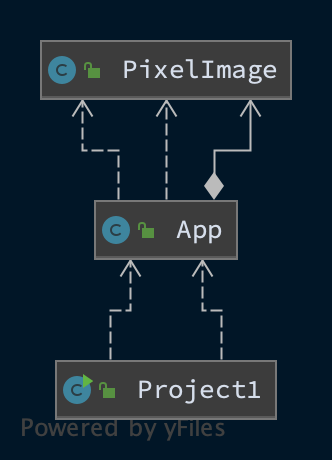
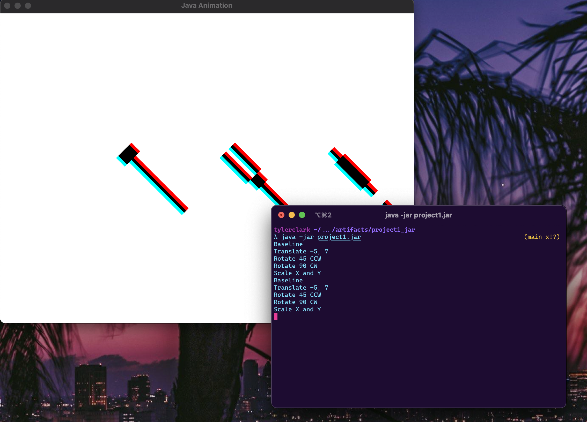
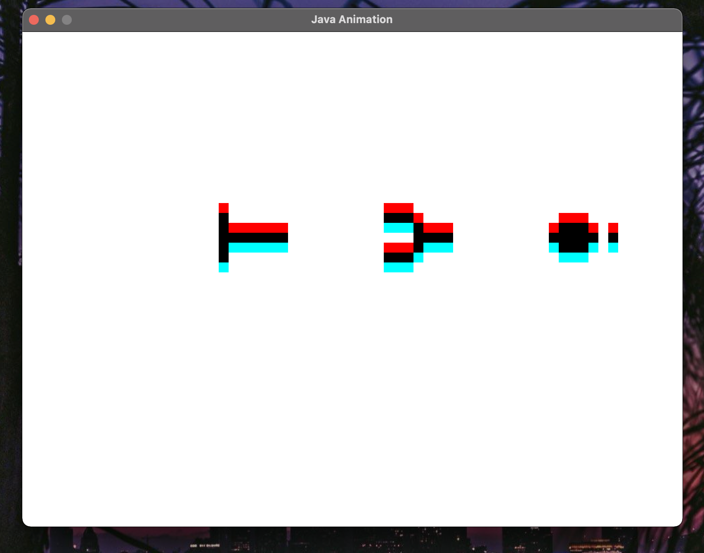
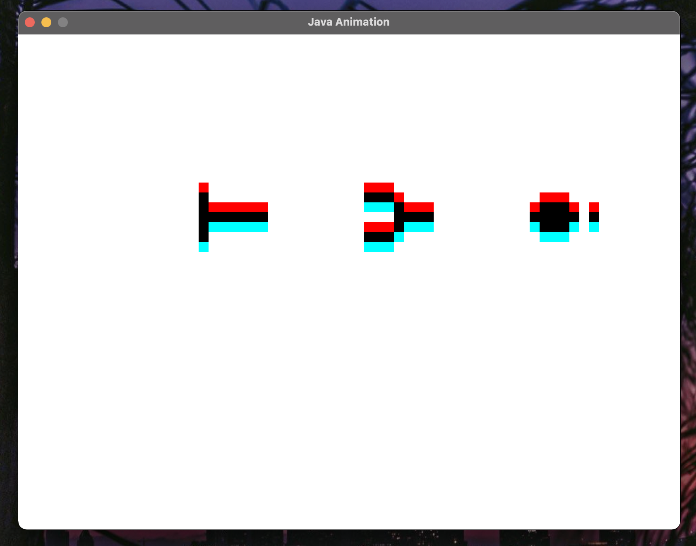
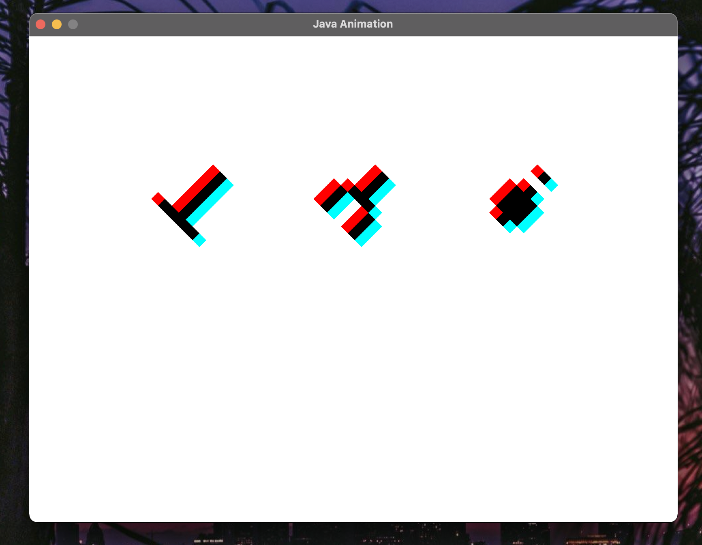
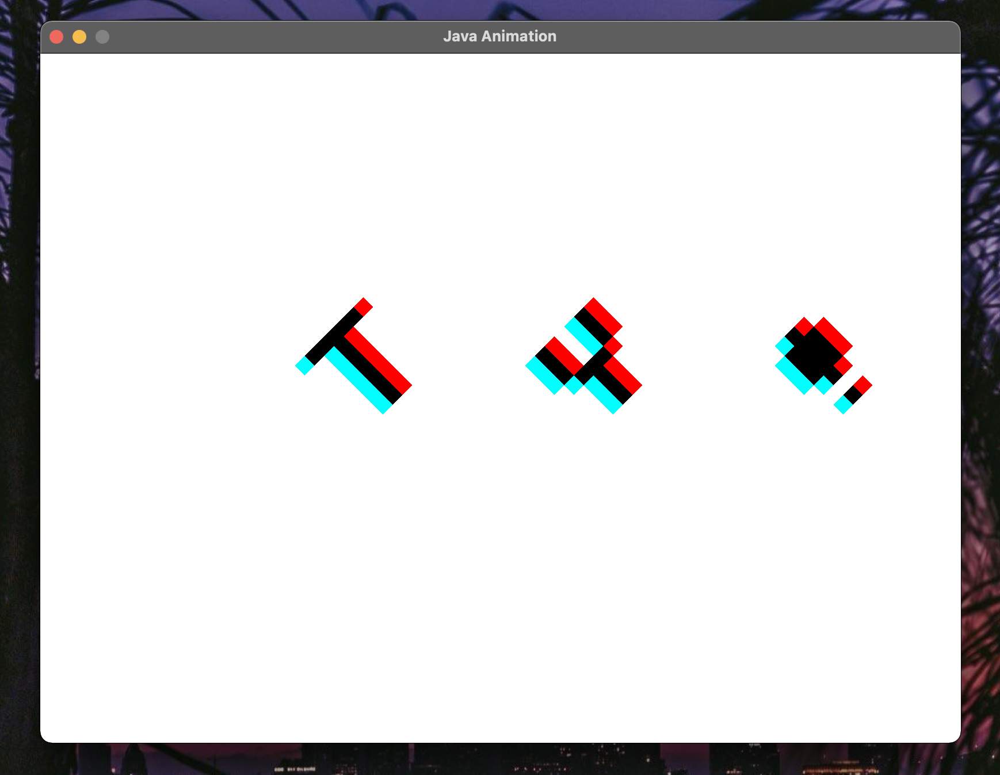

# CMSC 405 - Project 1 - Java 2D Graphics

**Author:** Tyler D Clark  
**Date:** 23 January 2021

**Description** A program that simulates traffic using swing GUI, event handlers, listeners and incorporates Java’s concurrency functionality and the use of threads. The program first prompts for the number of column and row roads and initial cars. It then creates a canvas and allows the the traffic simulation to be started, paused, stopped and additional cars to be added.

___

## File Layout

``` bash
|____doc
| |____project3.md
|-----out
| |_____project3.jar
|____src
| |____META-INF
| | |____MANIFEST.MF
| |____dev
| | |____tylerdclark
| | | |____traffic
| | | | |____Road.java
| | | | |____NorthSouthRoad.java
| | | | |____TrafficLight.java
| | | | |____EastWestRoad.java
| | | | |____Car.java
| | | |____util
| | | | |____Timer.java
| | | | |____LightStatus.java
| | | |____gui
| | | | |____BackgroundCanvas.java
| | | | |____MenuPanel.java
| | | | |____MainFrame.java
| | | | |____App.java
| | | | |____InitialPanel.java
```

## UML Diagram

It's very busy looking!



## Running this program

This program was compiled into a jar file for ease of use. The only requirement for this program is an up-to-date Java runtime to be installed on the machine. To run this program, simply enter the command while in the out directory:

``` bash
java -jar project3.jar
```

Screenshot:


## Testing the Program

The following sections will test the program's functionality to start various simulations, pause and stop them.

### Test case 1

The first test case will simply test the programs ability to start a traffic simulation with 2 row roads and 2 column roads and 2 cars. These are the default options of the initial panel.

Screenshot:


### Test case 2

This test will test the ability of the program to start. After pressing "Start, the timer will begin counting and every second the cars will move (unless they are at a red light). The cars will move a random amount that is set in their constructor.

Screenshot:


### Test case 3

The pause is a boolean inside the timer object that is passed to all Threads. This test case shows that when the "pause" is set to true by the JButton, all worker pause.

Screenshot of starting pause:


Screenshot of a bit after pause is pressed:


### Test case 4

The Stop button replaces the JPanel that is being drawn to with a new one with matching starting conditions of the previous one. The cars are still randomly placed. This test case will test that Stop does create a new canvas and it will also test add new random cars using the "Add a car" JButton.

After pressing "Stop", new canvas:


Adding a few cars:


### Test case 5

This test case will test the max options in the initial panel. This simulation is to have 10 rows, 10 columns and 10 initial cars

A busy-looking simulation with 111 SwingWorkers:


## Discussion / Lessons learned / Conclusion