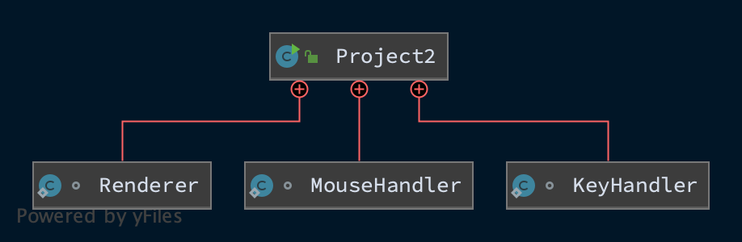
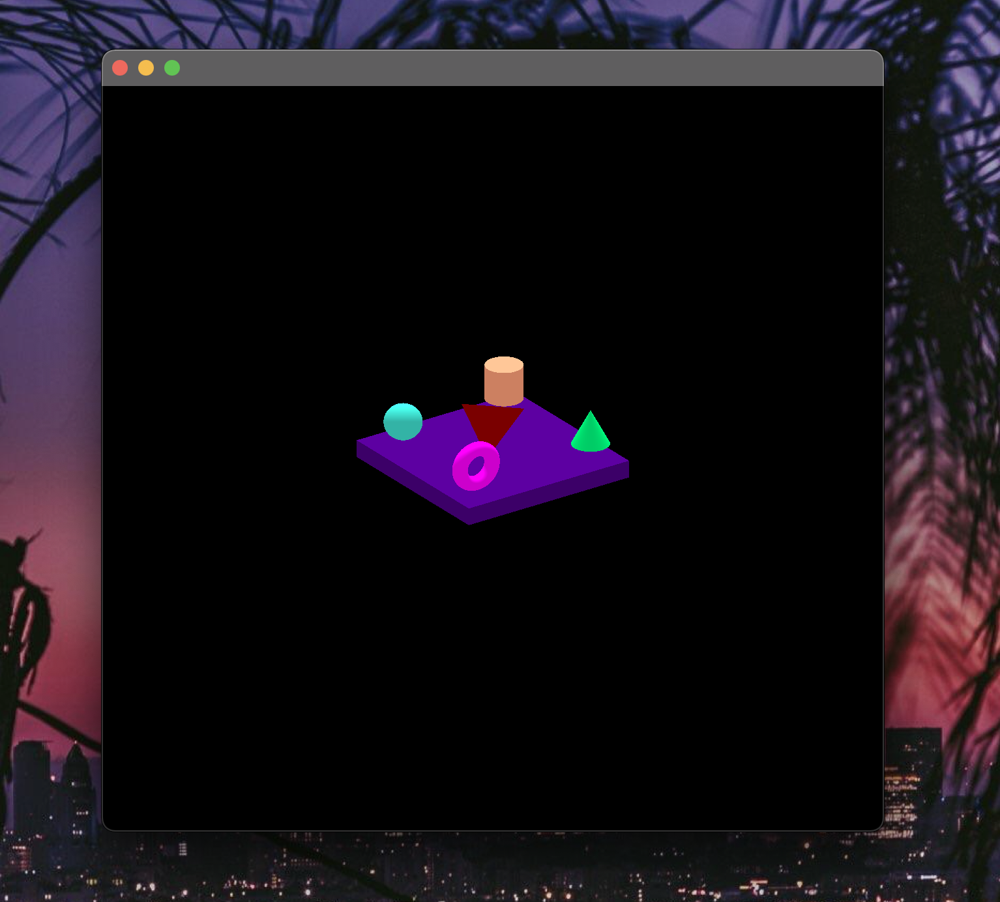
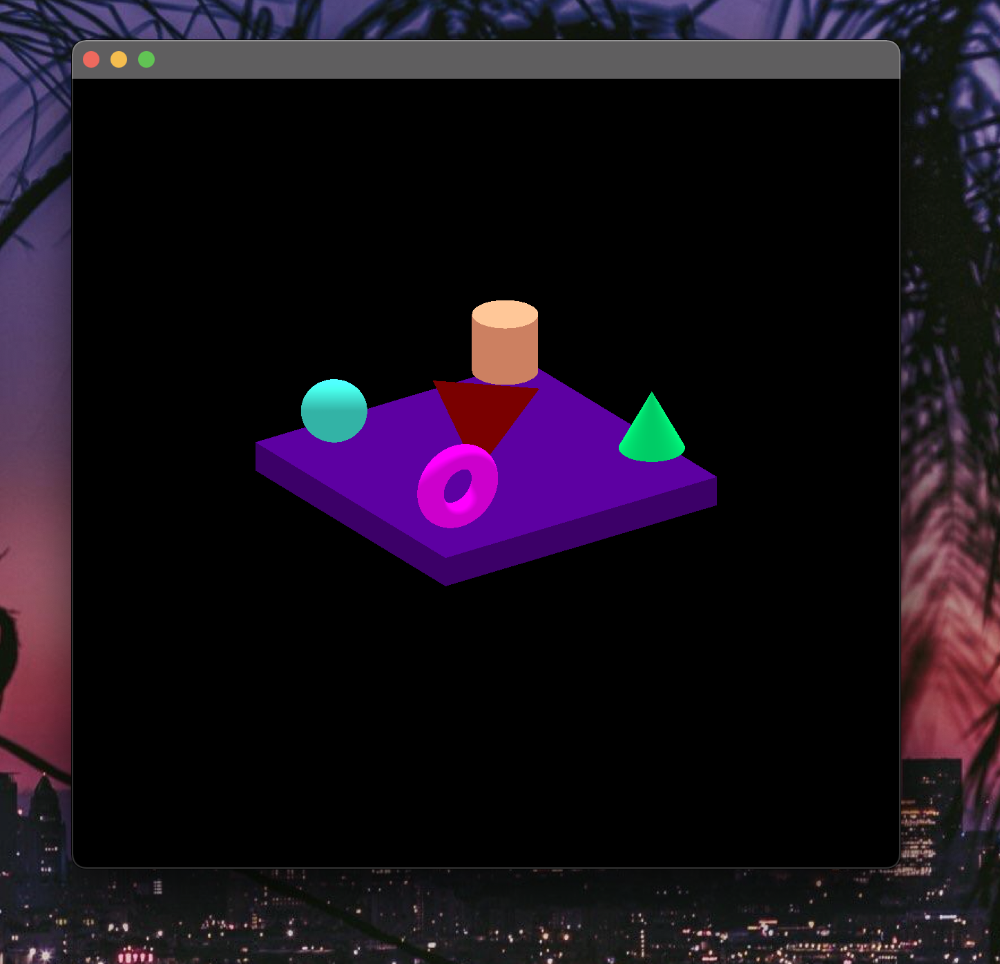
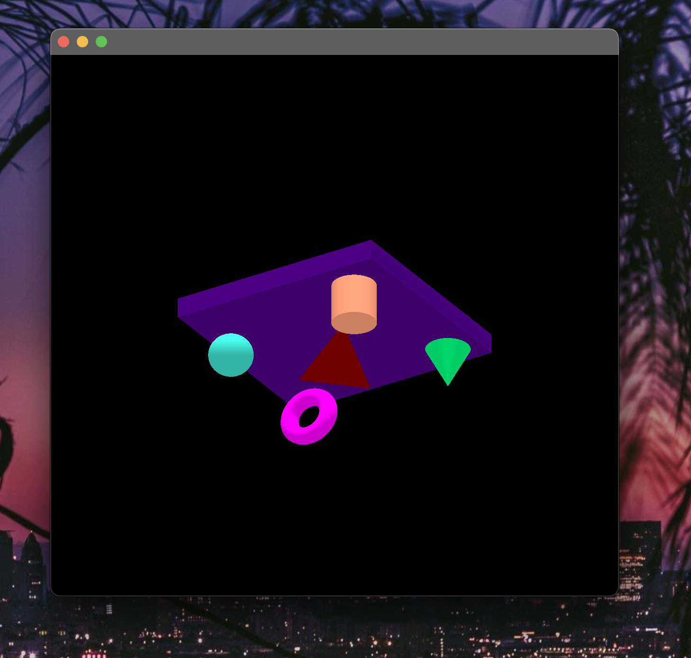
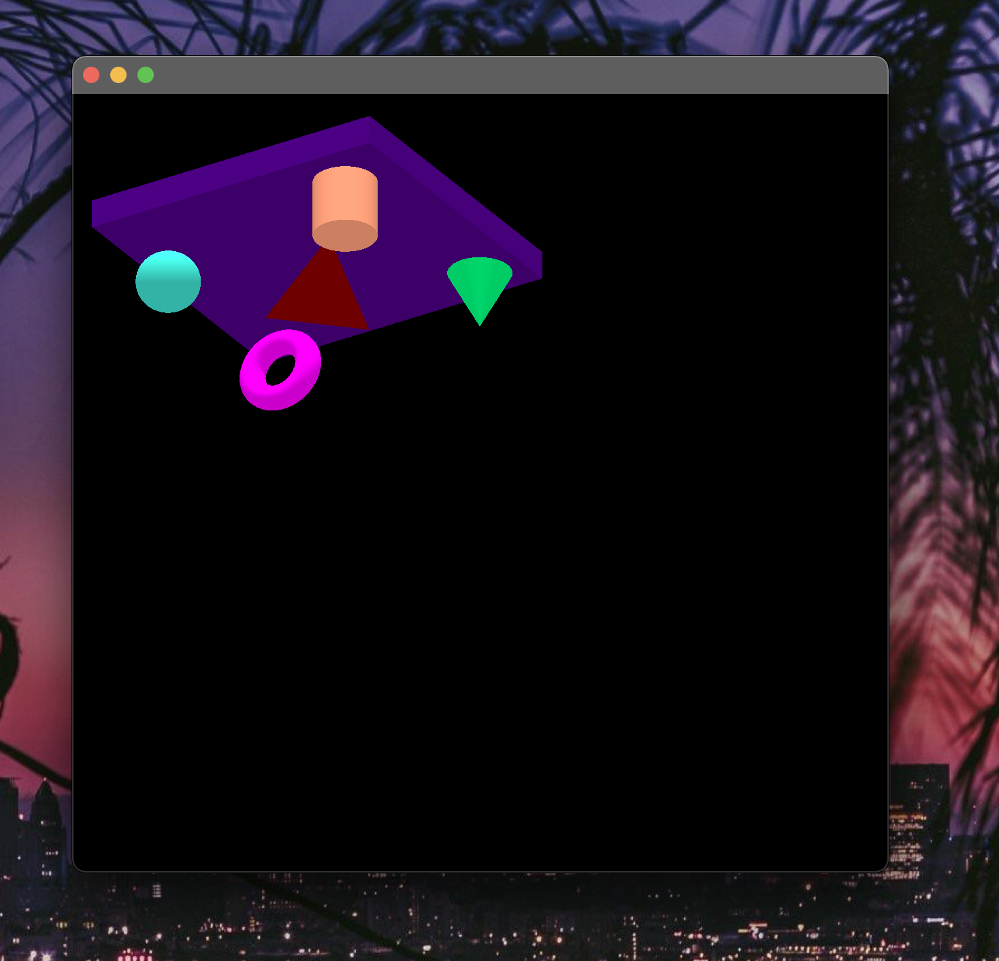

# CMSC 405 - Project 2 - Java 2D Graphics

**Author:** Tyler D Clark  
**Date:** 8 Feb 2021

**Description** A program that creates a unique 3D graphics scene composed of OpenGL graphic components using transformation methods. The generated 3d images can be rotated by pressing and dragging the mouse, scaled up with the 'a' key, scaled down with the 'z' key, and translated with the arrow keys.

___

## File Layout

``` bash

|____doc
| |____img
| |____project1.md
|____src
| |____main
| | |____java
| | | |____Project2.java
```

## UML Diagram



## Running this program

In order to run this program, the user will need to link all of the necessary libraries. These include jogl-all.jar, gluegenrt.jar, as well as the gluegen and jogl jars for your native operating system.

On my machine, I use IntelliJ IDE so, in the project settings, I linked the libraries: File > Project Structure > Libraries > Add

Or they can be linked using the command-line:

``` bash
javac  -cp  path/to/jogl-all.jar:path/to/gluegen-rt.jar:.  MyOpenGLProg.java
```

## Testing the Program

The following sections will test the program's various functionalities. The program is a scene with various shapes and certain key commands will cause them to translate, rotate, etc..

|Test Case|OpenGL Transformation|Input|Expected Output|Actual Output|Pass/Fail
|---|---|---|---|---|---|
|1|None - images unaffected| None|Original images|Original images|Pass|
|2|Scale|a key(x's 5)|zoomed in image|zoomed in image|Pass|
|3|Rotate|Mouse press and drag|rotated image|rotated image|Pass|
|4|Translate|Arrow keys|translated image|translated image|Pass|

## Screenshots

### Test case 1


The original images without transformations

### Test case 2


The images scaled

### Test case 3


The images rotated via mouse input

### Test case 4


The images translated via arrow keys
