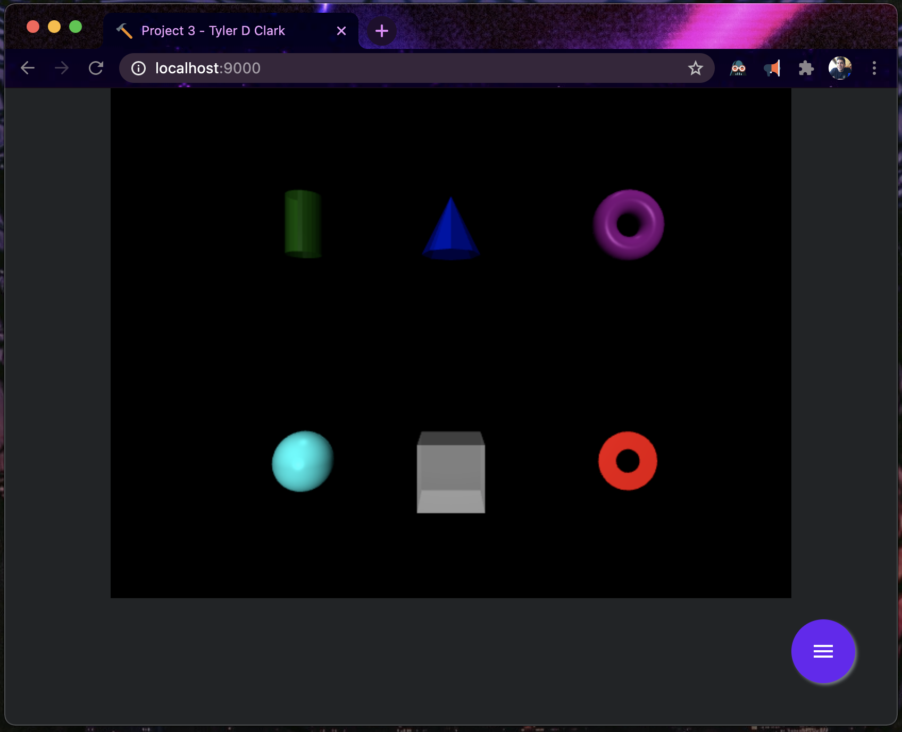
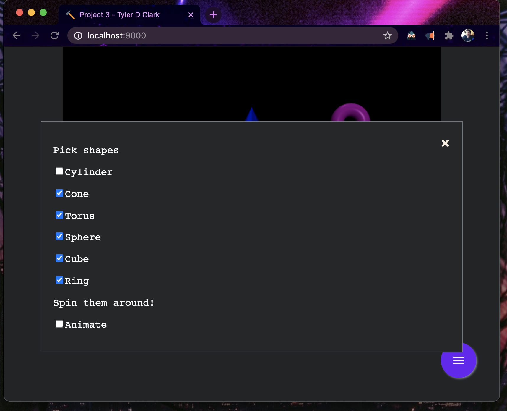
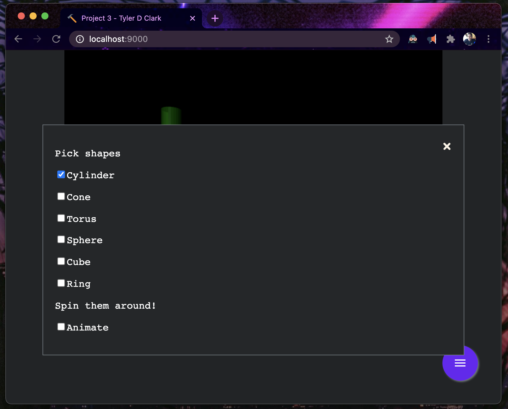
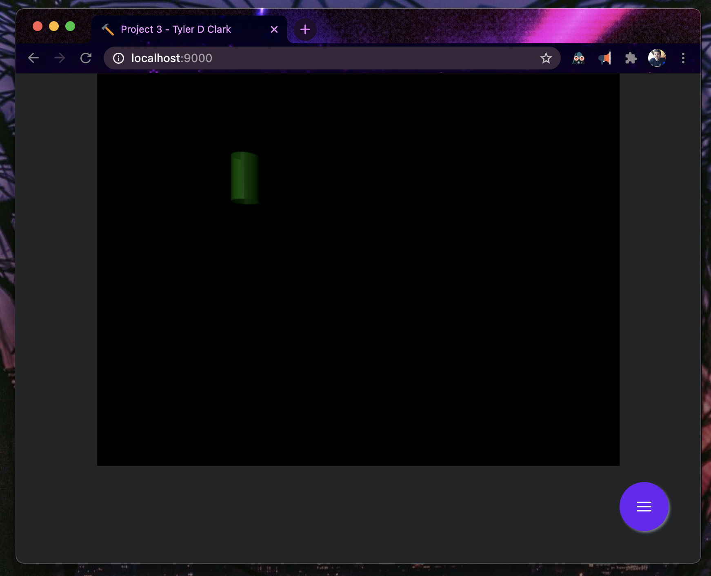
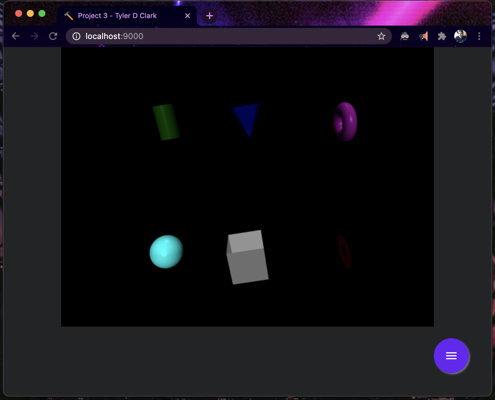
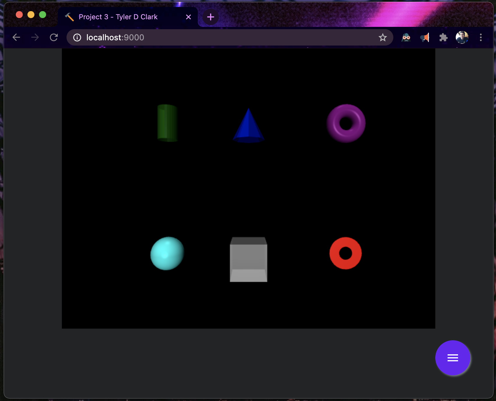

# CMSC 405 - Project 3 - Three.js Project

**Author:** Tyler D Clark  
**Date:** 22 Feb 2021

**Description** A program that prints several shapes and allows them to be animated and rotated.
___

## File Layout

```bash
.
├── doc
│   └── project3.md
├── index.html
├── package-lock.json
├── package.json
├── public
│   └── bundle.js
├── src
│   ├── index.js
│   └── modal.js
├── static
│   ├── favicon.ico
│   └── styles
│       └── main.css
└── webpack.config.js
```

## Running this program

This program is using npm for packages and webpack for maximum compatibility. To run it, you will need to have npm installed and will use an included npm script to build/run. First step is to enter the containing directory.

```bash
cd project3
```

then next, you will need to install the dependencies using the command:

```bash
npm install
```

a node_modules directory will populate and you will be ready to
to serve up the program using the following command:

```bash
npm run start
```

You will then be able to navigate to <http://localhost:9000/> to view the webpage.

Screenshot of program running:


Alternatively, you can build a bundle.js file into the public directory using the command:

```bash
npm run build
```

and view the index.html with a browser or live server of choice

## Testing the Program

The program allows each individual shape to be shown and removed. Additionally, the shapes can be rotated around all axes. The purple modal circle contains the options for the program.

### Test case 1

Using the modal menu, de-selecting the checkbox for cylinder should remove it from view.

Screenshots:




### Test case 2

Now the rest of them!

Screenshots:





### Test case 3

Lastly, by selecting the last option, we can make them animate rotating around x and y axes. Additionally, using the 'a' and 'z' key can rotate around the z axis. Using the 'esc' will reset it back.

Screenshots:




