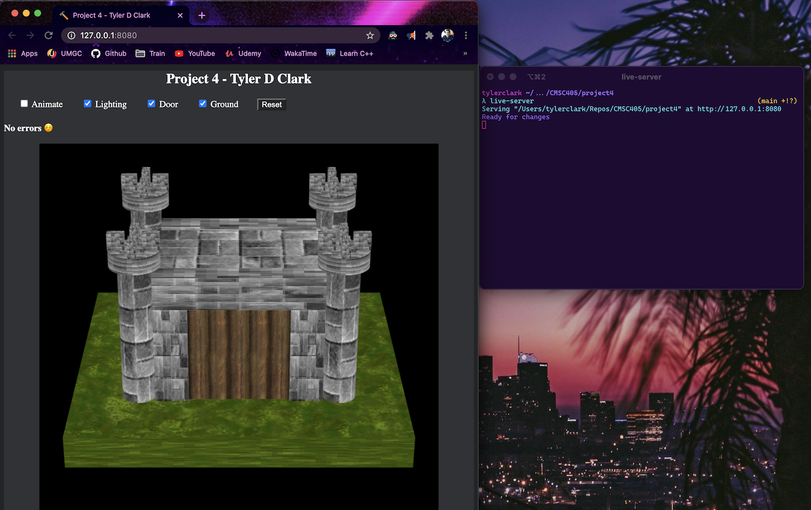
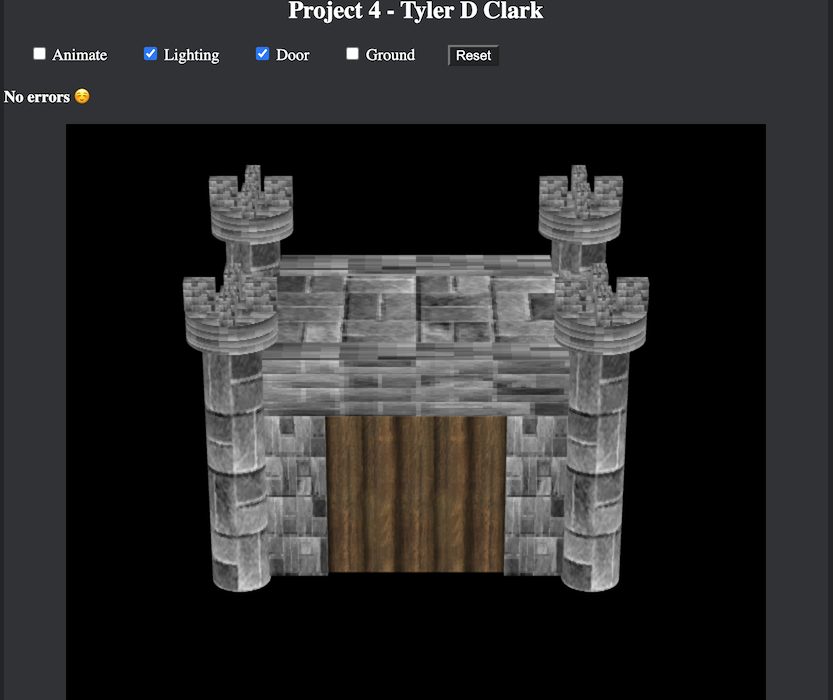
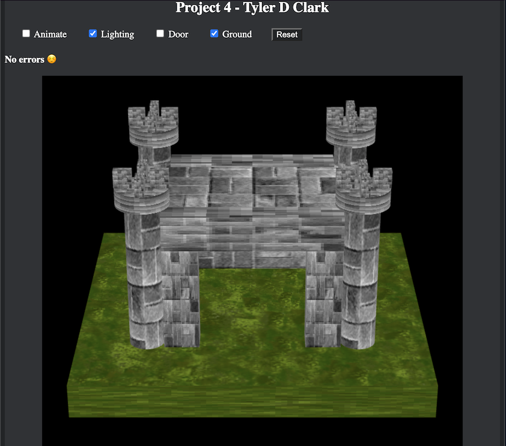
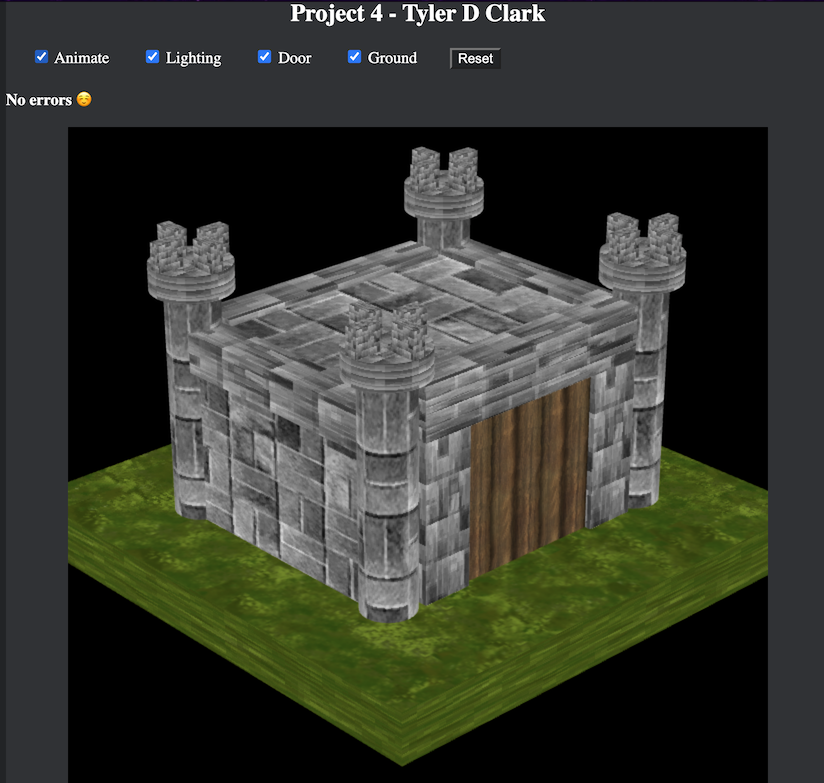
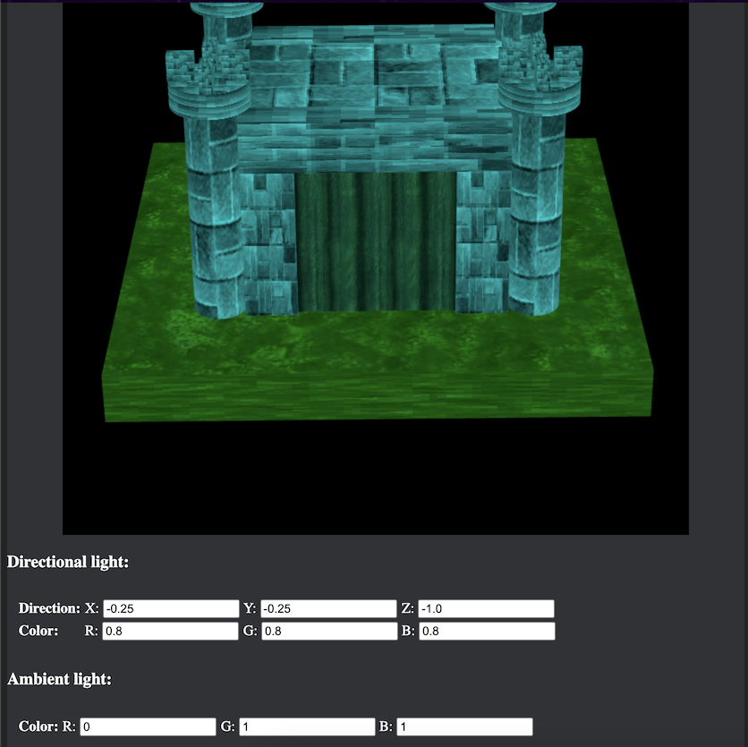

# CMSC 405 - Project 4 - WebGL Project

**Author:** Tyler D Clark  
**Date:** Mar 9 2021

**Description** A 3d WebGL scene with lights and textures. The program uses trackball-rotator for rotation using the mouse, basic-object-models-IFS for 3d objects, and gl-matrix for matrix math tools.
___

## File Layout

```bash
.
├── doc
│   ├── Project 4.pdf
│   └── project4.md
├── index.html
├── js
│   ├── basic-object-models-IFS.js
│   ├── gl-matrix-min.js
│   ├── index.js
│   ├── shader-source.js
│   └── trackball-rotator.js
├── static
│   ├── favicon.ico
│   └── styles.css
└── textures
    ├── brick.jpg
    ├── grass.png
    └── wood.png
```

## Running this program

The best way I have found to run this program is with either text editor (such as VSCode) HTML preview tool, or with a simple server.

live-server is a npm package and my perferred way to spin up a site. To use it, you will need node.js and npm installed.

To install, you can use the command:

```bash
npm install -g live-server
```

Then navigate to the folder containing the index.html

```bash
cd project4
```

and call the program:

```bash
live-server
```



## Testing the Program

The following test case will examine various parts of the program and display screenshots.

### Test case 1

By selecting and de-selecting the checkbox "ground", the grass-textured cube should appear and disappear.

screenshot:



### Test case 2

By selecting and de-selecting the checkbox "door", the wood-textured door should appear and disappear.

screenshot:



### Test case 3

By selecting and de-selecting the checkbox "animate", the scene should rotate and stop rotating.

screenshot:



### Test case 4

Lastly, adjusting the ambient color values should change the color of the ambient light.

screenshot:

